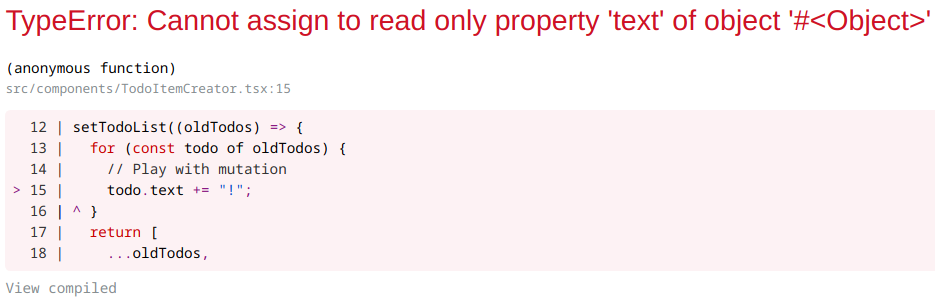

# Recoil tutorial

Following https://recoiljs.org/docs/introduction/getting-started

### Thoughts

- Pretty typical setup, with a contex-y component that influences everything else

- Atoms are like a useState hook that can be used in multiple places, and has other bells and whistles, I guess?

- They have selectors, which are your typical derived state, smartly executed, I guess.

- It seems they really want you to use these atoms and selectors as global singletons. Not injected through context or anything. I am not sure I like that.

- Stuff in recoil is immutable and has to be "massaged" like with redux. They have some kind of runtime check, at least it dev.

- Todo editor directly writes into an atom. It also does findIndex at each keystroke, basically, in every todo item. A bit wasteful. Are they trying to show off, or are careless? 

- Having to write a unique text description of an atom feels weird. It's not like I am later using that somewhere. It's only for testing or debugging?

- I wonder if I can put atoms in context, instead of using them as globals?
